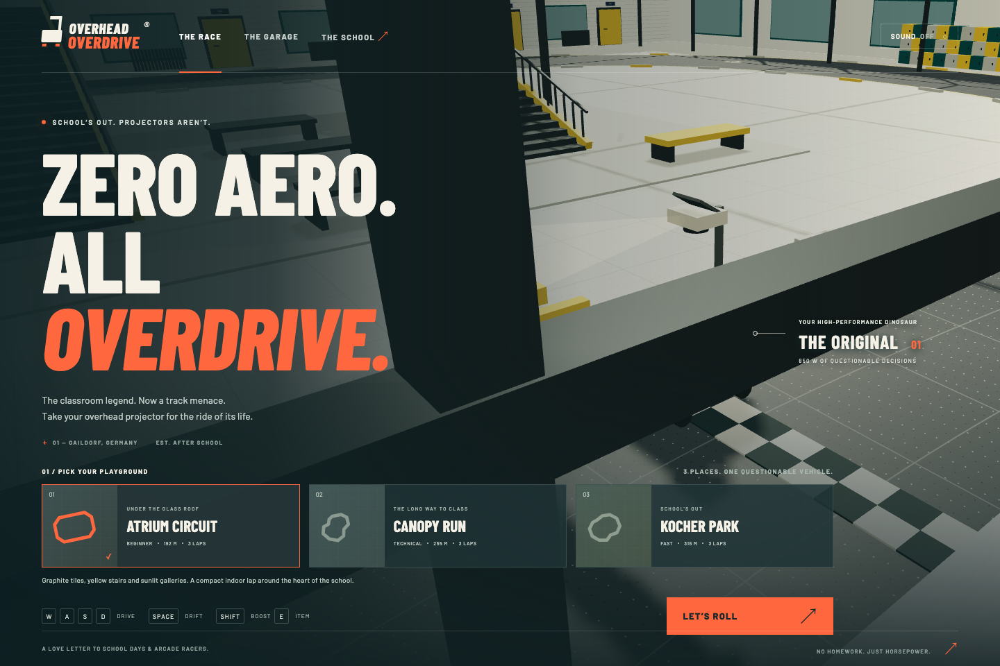

# Overhead Overdrive

**Old-school hardware. After-school horsepower.**

A playable 3D overhead-projector racing game set in a stylized interpretation of Schenk-von-Limpurg-Gymnasium in Gaildorf. Race a vented classroom projector on four casters, drift around the atrium, overdrive the lamp, and try to beat your personal best.



## Play locally

Requires Node.js 22.18+ and a WebGL2-capable browser.

```sh
npm install
npm run dev
```

Open the local URL printed by Vite (normally http://localhost:5173). Choose a circuit, optionally change your setup in **The Garage**, and press **Let’s Roll**. Sound is opt-in using the header toggle. For a production build:

```sh
npm run build
npm run preview
```

## Deploy to Vercel

Live game: [overhead-overdrive.vercel.app](https://overhead-overdrive.vercel.app).

See [SECURITY.md](SECURITY.md) for response headers, security checks and server-side validation of online competition.

The project uses Vercel's Vite preset, `npm run build`, and the `dist` output directory (configured in `vercel.json`). Offline racing needs no backend. Before deploying online competition, configure the database and server secrets described below.

```sh
npx vercel@latest login
npx vercel@latest link --project overhead-overdrive --scope niklas-heers-projects
npx vercel@latest deploy --prod
```

Omit `--prod` for a preview deployment. CLI deployments include the current local source, including uncommitted changes. The linked GitHub repository also deploys pushed changes; commit local work before relying on Git deployments. Local Vercel credentials and project metadata are gitignored. Reference documents and ready-exported GLB files are excluded from deployment; the game generates its downloadable school models in the browser.

## What is playable

- **The Club → School Records:** three-lap solo time trials, weekly and all-time top-50 boards for each course/setup, server replay verification and shareable translucent ghosts. These records are separate from offline best times. Pure time-trial rules include boost and drift kicks; rivals, items and mischief lanes are reserved for ordinary races.
- **The Club → Private Friend Rooms:** up to four players, invitation links, bots in spare slots, a shared countdown, server-controlled movement and items, and host rematches. A local pause opens the menu while the online race continues. The first release uses bounded HTTP room updates and client prediction; lag and reconnects can cause visible corrections.

### Running the online features locally

Run `npm run dev:online` in a second terminal alongside `npm run dev`. Vite proxies `/api/online` to the local API on port 5174. This development server uses temporary in-memory records and rooms, which disappear when restarted. It never substitutes memory storage in production.

For production, connect an **Upstash Redis Free** database to the Vercel project (region `fra1`, `autoUpgrade=false`, `prodPack=false`, eviction disabled). Marketplace terms require the account owner's acceptance. The server accepts `UPSTASH_REDIS_REST_URL` / `UPSTASH_REDIS_REST_TOKEN`, or the integration's `KV_REST_API_URL` / `KV_REST_API_TOKEN` names. Add `ONLINE_SESSION_SECRET` as a Vercel Secret with at least 32 random bytes. The canonical origin defaults to `https://overhead-overdrive.vercel.app`; set `ONLINE_ORIGIN` when using another production domain. These are server variables, never `VITE_*` variables.

The free launch limits are four simultaneous rooms, ten-minute room lifetime, three-minute races, and 30,000 uncached online API requests per UTC calendar month. Provider quotas also apply; this is a small friends-and-family release, not a promise of unlimited free multiplayer. If online service is unavailable, offline play remains available. Database auto-upgrade must stay disabled to preserve the free-plan constraint.

```sh
npm test
npm run build
GAME_URL=http://localhost:5173 node scripts/online-live-smoke.mjs
```

The live smoke uses two independent browser sessions and the actual API, then drives a full time trial using public keyboard controls. It writes an ordinary visible QA record; run it against local development unless a production QA entry is intended. Baked collision geometry in `src/online-course-data.json` is generated by `node scripts/export-online-courses.ts`; regenerate it and bump `ONLINE_VERSION` when track or physics rules change.

### Offline racing and school model

- Three circuits: **Atrium Circuit** (192 m), **Canopy Run** (255 m), and **Kocher Park** (316 m).
- Three-lap races against three opponents using the same vehicle dynamics as the player: The Prefect takes precise lines, Turbo Tutor boosts and overtakes, and Loose Caster makes brief drifting turns.
- Sequential checkpoints, exact finish-line crossing, finishing-order tracking, race timer, and local personal bests per track and setup.
- Four selectable colored 3D stick-figure riders: **The Doodler**, **Lab Partner**, **Lunch Break**, and **Night Shift**. Choose in **The Garage**; the **Classic** toggle restores the rider-free projector. Crew selection is remembered locally.
- Riders stand on rear footboards, grip the trolley handle, lean into corners, crouch under boost, react to laser hits and wave at the finish. Hands and feet remain attached through animation. Round heads, slim capsule limbs and simple faces keep the driving view clear.
- Brief comic asides react to driving, with at most two bubbles and a ten-second per-rider cooldown.
- Three handling setups: balanced Original, grippy Hall Monitor, and powerful Loose Cannon; five paint colors.
- Caster drifting with a charge-and-release speed kick: blue sparks build to gold, then release Space while accelerating to launch. Contact cancels charge, and manual boost shares an acceleration ceiling.
- Expressive lens heads look into corners, recoil under boost and droop when tagged. Casters swivel and chatter; body lean stays separate from the grounded wheels.
- Gold-chevron mischief lanes: flying worksheets and wobbling books in the atrium, rumble strips under the canopy, and leaf bursts in the park. Each gives a bounded speed kick and lamp recharge. A nervous cleaning robot yields to approaching racers.
- Visible skid trails, a flexing mast, acceleration squat, impact wobble, quadratic drag, and rechargeable lamp boost with thermal lockout.
- Chase and overhead cameras, minimap, recovery, pause, restart, and untimed free driving.
- Keyboard, clickable item slot, and small-screen touch driving controls.
- Collectible laser pointers (three shots), seven-second one-hit transparency shields, and two-second capacitor boosts. Press **E** or **Q** to use the equipped item.
- Lasers tag rivals for a short slowdown. Temporary hit immunity prevents repeated stun-locking, scenery blocks beams, and glowing **POP QUIZ** targets recharge lamp energy when hit.
- Rival name/position panel, item status display, brief hit feedback, and speed-sensitive camera framing.
- Gentle projector fan/hum, caster rolling and drift sounds, plus distinct pickup/laser/shield effects. Sound can be toggled during a race.
- Compact 3D laser pens, acetate shields and capacitor cartridges, with near-camera fading and rigidly mounted laser pointers.
- A textbook finish podium and counts of caster kicks, laser tags and mischief moments.
- Original procedural 3D school scenery, projector models, materials, signage, and synthesized audio.
- **The School → Download this 3D school** exports the selected environment as GLB. Ready-exported models are in [`models/`](models/).

## Controls

| Input | Action |
| --- | --- |
| W / ↑ | Accelerate |
| S / ↓ | Brake, then reverse |
| A / D or ← / → | Steer |
| Space | Hold with steering and throttle to charge a drift; release for a caster kick |
| Shift | Lamp overdrive |
| E / Q / click item slot | Fire laser or use held power-up |
| R | Recover at the last checkpoint (+2 seconds during a race) |
| C | Switch chase / overhead camera |
| Esc | Pause / resume |
| Enter | Start from track selection |

Lift or brake before tight turns; short handbrake taps help rotate the trolley. Steering authority decreases with speed. The Hall Monitor is the easiest setup for learning. Boost drains lamp energy and builds heat, then recharges when released. Switching away from the game pauses it automatically.

For a caster kick, enter a corner with speed, keep accelerating and hold Space while steering. The drift bar turns gold when ready; release Space to spend the charge. A wall/rival collision, reverse driving or a broken slide cancels it. Gold road chevrons mark optional school-mischief lanes; take them in the forward direction at speed for a burst and 12% lamp recharge.

Rider selection changes appearance and animation; handling, collision shapes and personal records are shared with Classic mode. The human is not a separately simulated ragdoll.

## The three places

**Atrium Circuit** is the indoor school hall: white brick, graphite tiles, yellow stairs, glass roof and galleries. **Canopy Run** threads an asymmetric route between separate school wings, a red-column covered passage, courtyards and curved bicycle shelters. **Kocher Park** leaves the forecourt for a wooded pond loop and the riverbank. Each has different geometry, scenery, turn rhythm and lap length. The source photographs and maps informed the architecture and setting; the route connections and dimensions remain adapted for racing.

The drift/mischief update uses a new local-record key (v3), so times with the new speed rewards do not compete with earlier handling. Previous records remain in browser storage.

## School model and photographs

The school's public photos informed the white brick, pitched glass atrium roof, graphite tiles, mustard-yellow doors and stairs, grey gallery railings, checkerboard lockers, and yellow benches. See [the photograph reference document](docs/school-reference.md) for direct interior/exterior image links and observed details.

This is an architectural interpretation designed for racing. Dimensions, room connections, course layouts and furniture arrangements are invented. It is not a measured, complete digital twin of the real school. Source photos are references only; they are not redistributed or used as textures. The roof is partially cut away to keep cameras usable. Each GLB represents one playable interpretation, with procedural textures embedded and repeated geometry using `EXT_mesh_gpu_instancing`.

## Physics approach

Dynamics run at a fixed **120 Hz**, independently of rendering. The vehicle has a planar velocity, heading and yaw rate. Longitudinal acceleration competes with speed-squared drag; capped lateral friction preserves inertia through corners; the handbrake reduces caster grip. Opposite throttle brakes before reversing. Impulses resolve circular and axis-aligned scenery contacts, with rubber-like restitution, plus racer-to-racer contacts. Damped springs animate chassis roll, pitch and mast flex. Stock cruising speed is around 16 m/s (58 km/h).

This is an arcade vehicle model with physically motivated behavior. Wheels do not independently simulate suspension or free-swiveling caster joints. Vertical motion, jumps, full rigid-body tipping and destructible furniture are outside this version. The deliberately bounded roll keeps the top-heavy projector controllable.

## Checks

```sh
npm test                 # 56 physics, items, rivals, rider, animation and mischief tests
npm run test:ai          # 9 full AI race simulations against actual world colliders
AI_PACK=1 npm run test:ai # also validate 9 three-rival pack completions
npm run build            # strict TypeScript + production bundle
```

With the dev server running in another terminal:

```sh
npx playwright install chromium
npm run test:browser     # menu, garage, controls, pause, recovery, tracks, tour, mobile
node scripts/steering-smoke.mjs # driver-relative A/D and arrow-key regression
node scripts/race-smoke.mjs    # keyboard-driven race with item use, finish + saved record
node scripts/items-smoke.mjs   # real pickup, laser, item UI, sound, pause/restart
node scripts/drift-smoke.mjs   # real keyboard drift charge/release, pulse and HUD
node scripts/rider-smoke.mjs   # crew selection, classic mode, repaint, persistence and mobile
node scripts/audio-check.mjs   # render and validate the actual audio graph
node scripts/export-models.mjs # regenerate and validate the three GLB exports
```

Browser scripts default to port 5173. `GAME_URL` overrides the URL for all browser scripts. The AI regression supports both independent and pack runs, including scenery, passing and racer contacts. It does not simulate combat; the keyboard race check includes the other racers and item use.

## Project structure

- `src/main.ts`: menu, race lifecycle, cameras, controls, HUD and export.
- `src/items.ts` / `src/item-view.ts`: tested item rules, inventory, beam hits, shields and visual effects.
- `src/rivals.ts`: distinct rival handling, driving lines, passing and boost decisions.
- `src/audio.ts`: original fan/rolling sound design and short item effects.
- `src/physics.ts`: dependency-free vehicle dynamics and contact response.
- `src/world.ts`: circuits, original school geometry/materials and projector model.
- `src/effects.ts`: bounded, instanced caster skid trails and drift sparks.
- `src/personality.ts`: cosmetic head, body and caster animation.
- `src/rider.ts`: original colored stick figures, attached footboards and articulated pose solving.
- `src/rider-feedback.ts`: bounded comic asides and tested reaction cooldowns.
- `src/mischief.ts`: track-specific reward lanes, pooled paper/leaf effects and yielding caretaker.
- `src/style.css`: responsive visual design.
- `docs/school-reference.md`: inspected photographs, supplied maps and reconstruction scope.
- `docs/audio-notes.md` / `docs/audio-preview.wav`: audio design notes and a render of the actual sound graph.
- `models/`: self-contained school GLB files exported from the playable scenes.

Built with TypeScript, Three.js and Vite. No backend or account required. Personal records use local browser storage. Fonts load from Google Fonts with local fallbacks; all gameplay geometry and materials are generated locally. A production build can run offline once served locally, using fallback fonts.
